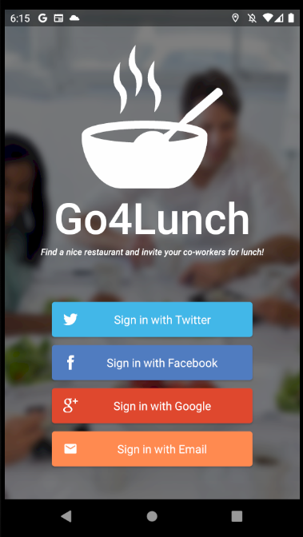
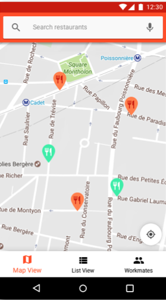
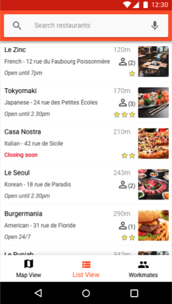
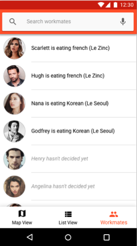
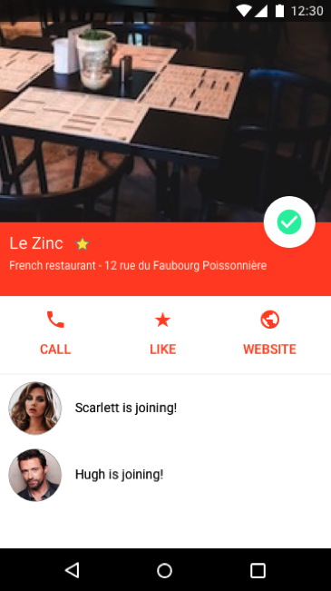
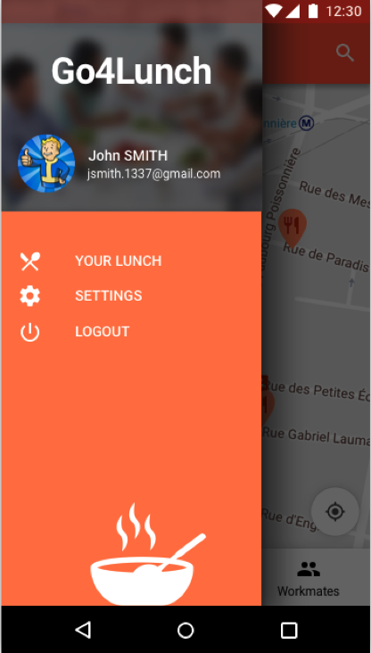

The Go4Lunch application is an Android application that allows you to choose where to eat with your work colleagues.
It allows you to search for a restaurant nearby and then select it by indicating it to your colleagues.

It is also possible to consult the restaurants selected by colleagues in order to join them.

At noon, a notification is sent to remind you the choice of the restaurant and the people who are coming to eat with you.

Translated with www.DeepL.com/Translator (free version)

This projet uses

- MVVM architecture
- Navigation Component
- Firebase Firestore
- Firebase Storage
- Firebase Auth
- Google sign-in
- Facebook sign-in
- Twitter sign-in
- Glide
- RxJava
- Retrofit
- Hilt
- Mockito
- Work Manager

